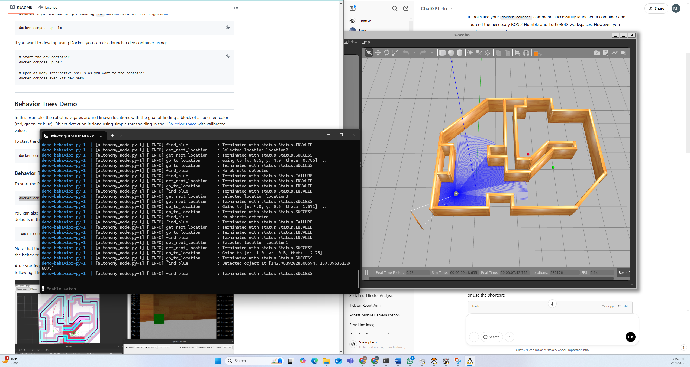
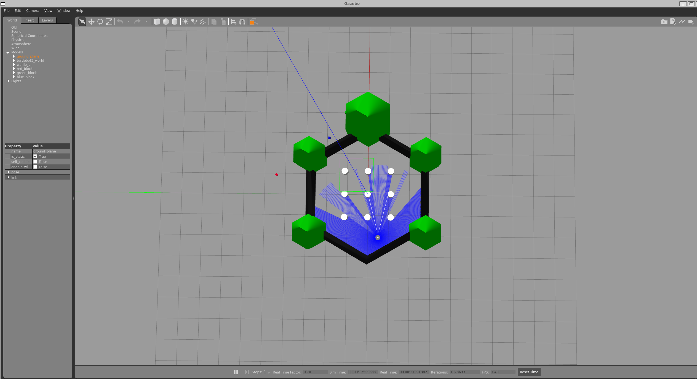

<figure>
    <figcaption><strong>ROS is running</strong>: Testing demo talker and listener. The talker publishes topic: "Hello World", and the listener receives the topic.</figcaption>
    
    
</figure>

<figure>
    <figcaption><strong>Turtle bot is in the maze world</strong></figcaption>
    
    
</figure>

<figure>
    <figcaption><strong>Turtle bot successfully reaches the target</strong></figcaption>
    
    
</figure>

<figure>
    <figcaption><strong>Gazebo</strong></figcaption>
    
    
</figure>

<figure>
    <figcaption><strong>Rviz</strong></figcaption>
    
    
</figure>

