<h1>Assignment 2</h1>
<h2>Webcam</h2>

<figure>
    <figcaption><strong>Publishing camera feed into a ROS topic and accessing it</figcaption>
    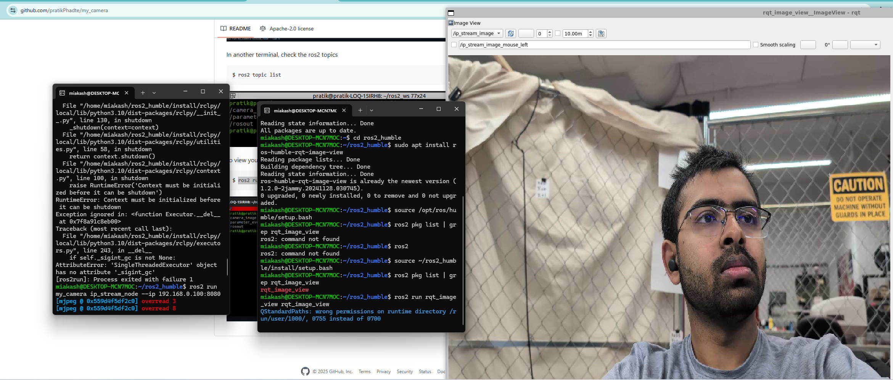
    
</figure>

<h2>Creating assets and embedding them in the maze</h2>

<figure>
    <figcaption><strong>Fire hydrant, stop sign and bowl on the benches are added in the maze.</figcaption>
    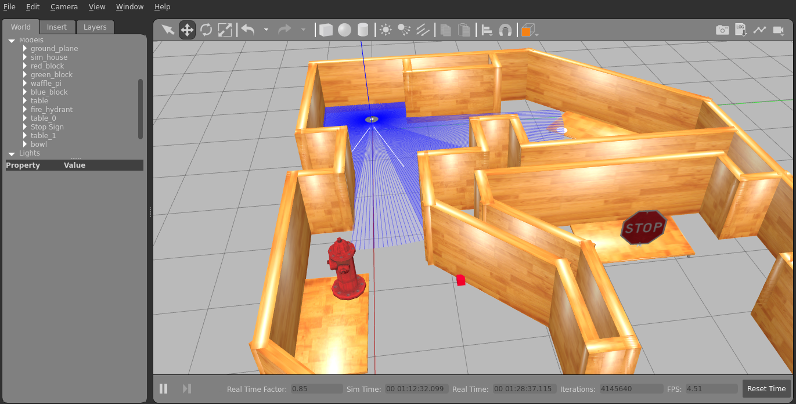
    
</figure>

<h2>Object detection for the simulated camera sensor</h2>

<figure>
    <figcaption><strong>Fire hydrant is detected</figcaption>
    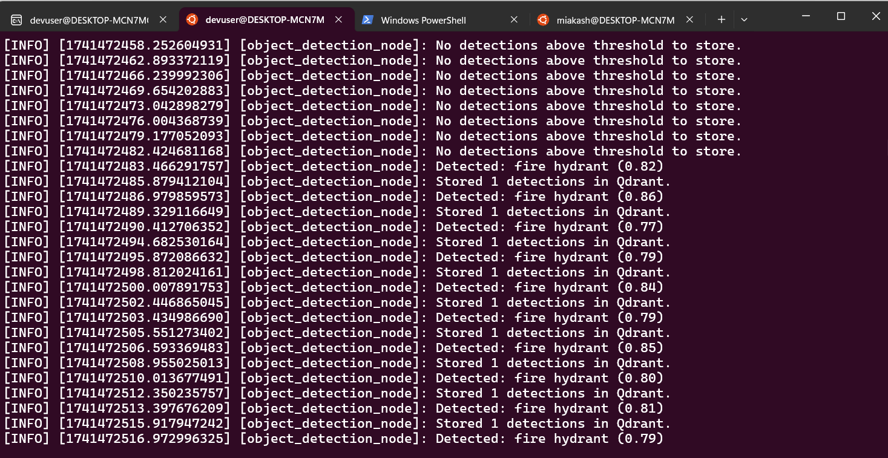
    
</figure>
<figure>
    <figcaption><strong>Stop sign is detected</figcaption>
    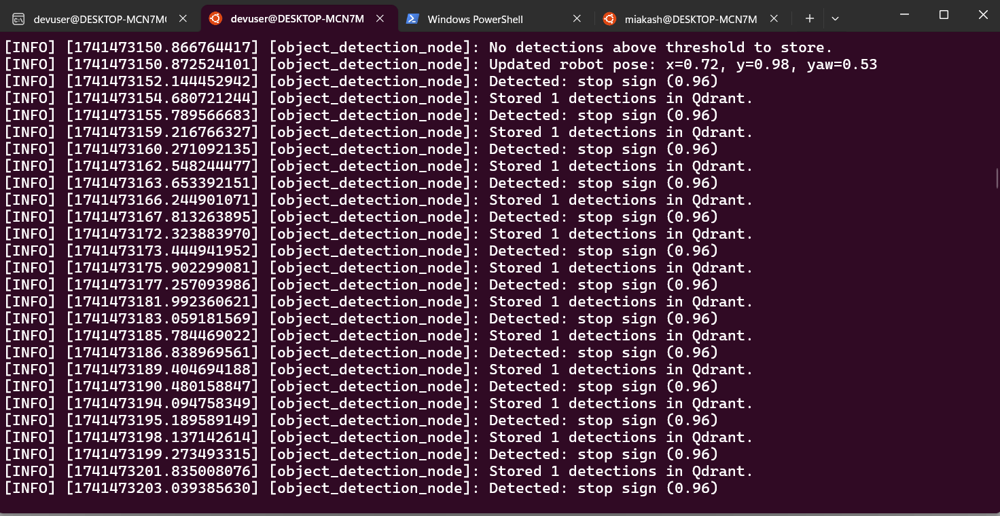
    
</figure>
<figure>
    <figcaption><strong>Bowl is detected as surfboard</figcaption>
    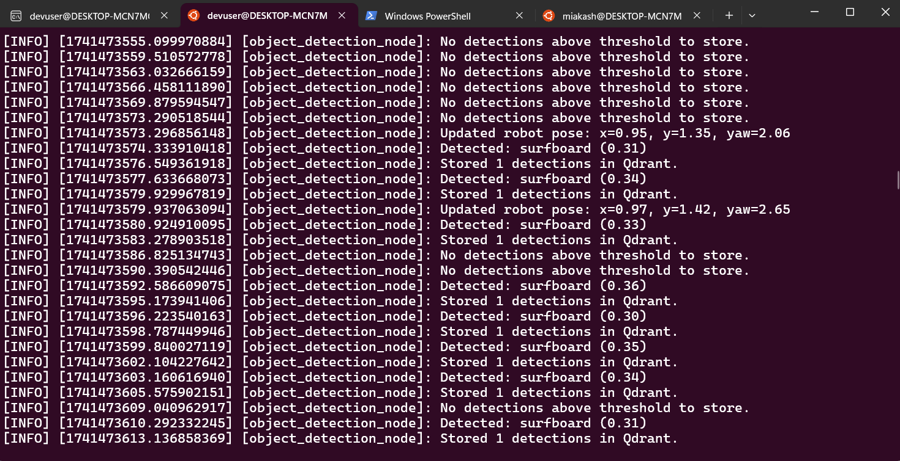
    
</figure>

<h2>Vector database and Semantic Localization</h2>

<figure>
    <figcaption><strong>Qdrant database - Metadata for fire hydrant</figcaption>
    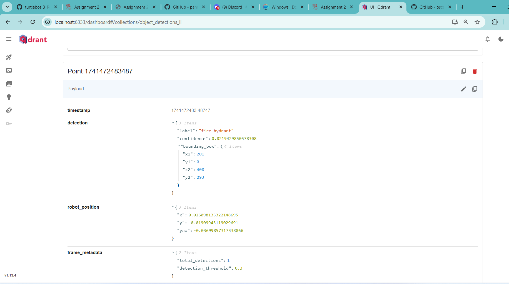
    
</figure>
<figure>
    <figcaption><strong>Qdrant database - Metadata for stop sign</figcaption>
    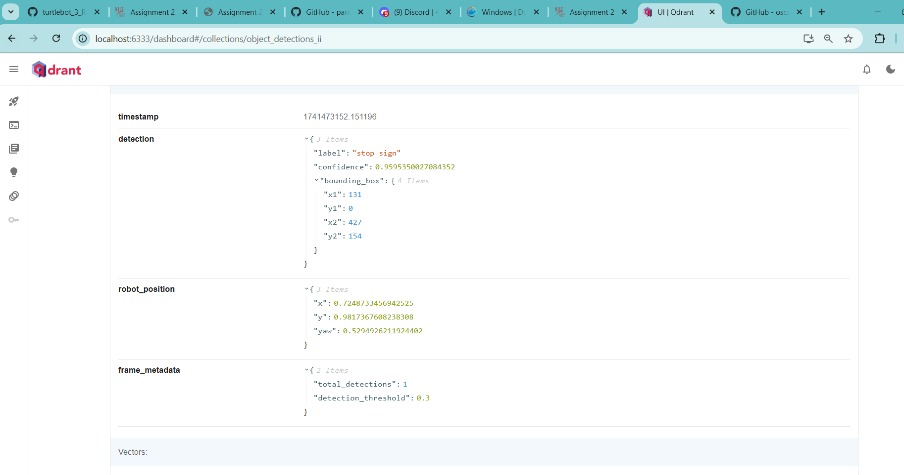
    
</figure>
<figure>
    <figcaption><strong>Qdrant database - Metadata for surfboard</figcaption>
    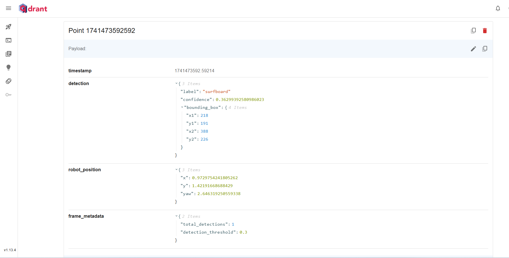
    
</figure>

<h1>Assignment 1</h1>
<figure>
    <figcaption><strong>ROS is running</strong>: Testing demo talker and listener. The talker publishes topic: "Hello World", and the listener receives the topic.</figcaption>
    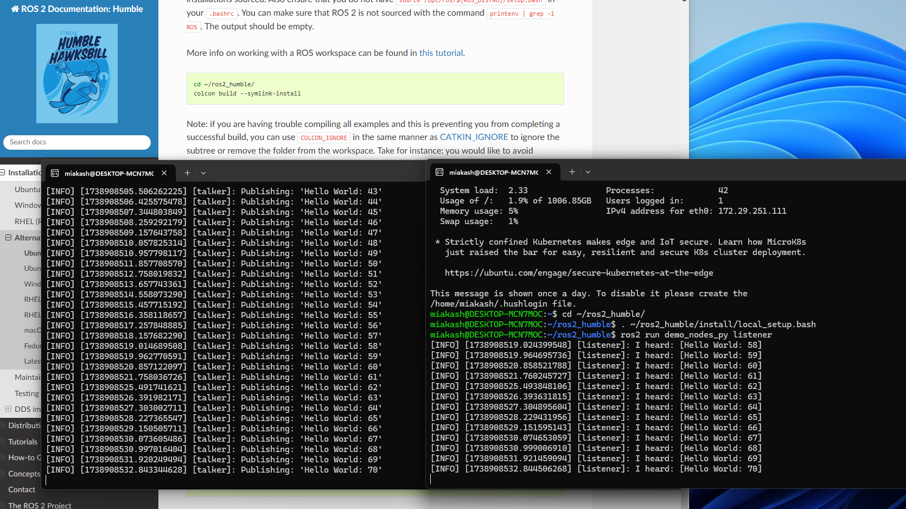
    
</figure>

<figure>
    <figcaption><strong>Turtle bot is in the maze world</strong></figcaption>
    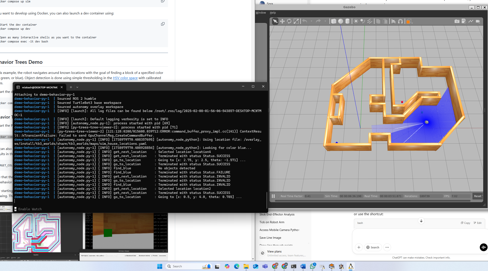
    
</figure>

<figure>
    <figcaption><strong>Pytree viewer and derection window</strong></figcaption>
    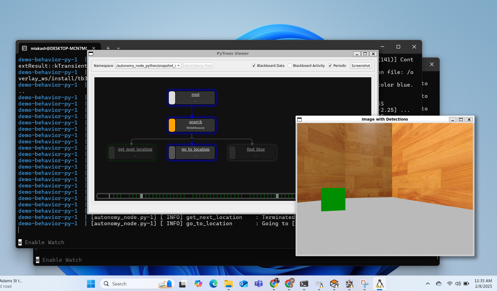
    
</figure>

